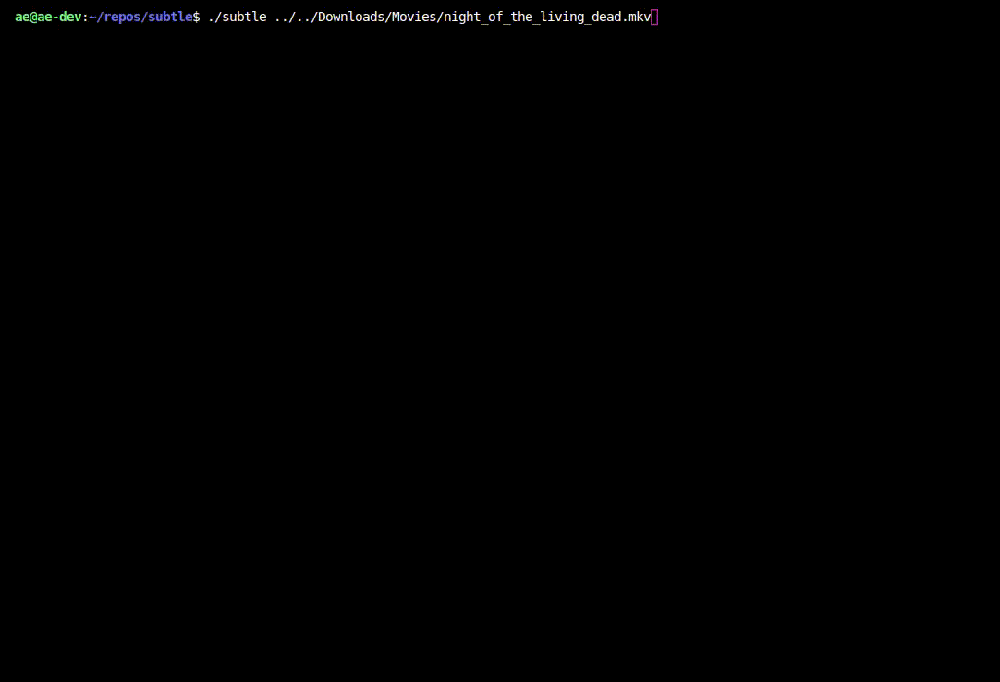

# subtle

[](https://travis-ci.org/alicanerdogan/subtle)
[](https://github.com/alicanerdogan/subtle/blob/master/LICENSE)
[](https://github.com/alicanerdogan/subtle/issues)

subtle is a cli application which is handy to download subtitles for movies and tv shows.



subtle depends on the following services:


[OpenSubtitles](http://www.opensubtitles.org)

## Installation

Binaries for various platforms can be downloaded from releases section.

## Quick Start

```sh
USAGE:
    subfind <FILE>

FLAGS:
    -h, --help       Prints help information
    -V, --version    Prints version information

ARGS:
    <FILE>    url to download
```


## License

[MIT](LICENSE).
